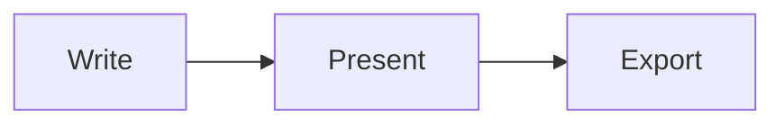

# Astlide

[](https://github.com/r-hashi01/astlide/actions/workflows/ci.yml)
[](https://www.npmjs.com/package/@astlide/core)
[](LICENSE)
[](https://bun.sh)

**Slides that live in your Astro site.**

Astlide is an [Astro](https://astro.build) integration for presentations. Write slides in MDX, Markdown or plain HTML, keep them next to your blog or docs, and ship every slide as a real static page.

📖 **Documentation:** https://r-hashi01.github.io/astlide/ · 🎬 **Live demo:** https://r-hashi01.github.io/astlide/demo/tour/1/

## Why Astlide

- **It's just Astro.** Add `astlide()` to an existing site and your talks sit next to your blog and docs — same repo, same components, same deploy. Content Collections, Astro components and any static host work as usual.
- **Every slide is a real page.** `/my-talk/7` is static HTML: link straight to a slide, load fast, deploy anywhere (including sub-paths like GitHub Pages).
- **Write in whatever fits.** Mix `.mdx`, `.md` and plain `.html` slides in one deck — paste hand-made or AI-generated HTML and it renders as-is.
- **Many decks, one project.** Every folder under `src/content/decks/` is a deck, with an index page out of the box.
- **Type-safe.** Frontmatter is validated with Zod; slide metadata has a typed API.

And everything you expect from a presentation tool:

- **Presenting** — presenter window with next-slide preview, steps left, notes and timer; overview, go-to-slide, pen and laser pointer, all mirrored to the audience screen
- **Reveals & code** — `<Fragment>` / `<Fragments>` (with `until` / `hide`), Shiki highlighting with `{1|3-5|all}` line steps
- **Diagrams & math** — Mermaid (loaded on demand) and KaTeX
- **Export** — PDF / PNG via Playwright, editable PowerPoint built from your MDX source, one-click in-browser PDF
- **Make it yours** — 7 themes, a plugin API (themes, layouts, transitions), slide decorators, a composable toolbar

## Quick Start

```bash
# Scaffold a new project
bun create astlide my-slides
cd my-slides
bun install
bun run dev
```

Or add to an existing Astro project:

```bash
bun add @astlide/core
```

Then configure:

```js
// astro.config.mjs
import { defineConfig } from 'astro/config';
import astlide from '@astlide/core';

export default defineConfig({
  integrations: [astlide()],
});
```

```ts
// src/content.config.ts
import { defineCollection } from 'astro:content';
import { astlideDeckLoader, slideSchema } from '@astlide/core';

const decks = defineCollection({
  // Renders .mdx, .md, and .html slides from src/content/decks/<deck>/
  loader: astlideDeckLoader(),
  schema: slideSchema,
});

export const collections = { decks };
```

## Creating a Deck

Scaffold one with the CLI:

```bash
bunx create-astlide deck my-talk --theme dark --format mdx   # or md | html
```

Or create it by hand:

1. Create `src/content/decks/my-talk/_config.json`:

```json
{
  "title": "My Talk",
  "author": "Your Name",
  "date": "2025-01-15",
  "theme": "default"
}
```

2. Add slides as numbered files — `.mdx`, `.md`, and `.html` can be mixed and sort by name:

```
src/content/decks/my-talk/
├── _config.json
├── 01-cover.mdx
├── 02-intro.md
└── 03-demo.html
```

### HTML & Markdown slides

Any slide can be a plain `.md` or self-contained `.html` file with the same frontmatter as MDX. HTML bodies are rendered verbatim (inline `<style>` and markup preserved — same trust level as MDX), which is handy for pasting in AI-generated or hand-crafted markup:

```html
---
slideLayout: cover
background: "#0b132b"
---
<style>.hero { font-size: 3rem; }</style>
<h1 class="hero">Everything in one HTML file</h1>
```

## Slide Frontmatter

> **Important:** Use `slideLayout` (not `layout`) — Astro MDX reserves the `layout` key.

```yaml
---
slideLayout: default
transition: fade
background: "#1e293b"
class: "text-light"
notes: "Speaker notes shown in presenter/notes mode"
hidden: false
---
```

## Layouts

| `slideLayout` | Description |
|---|---|
| `default` | Standard content slide |
| `cover` | Centred title / closing slide |
| `section` | Chapter divider |
| `two-column` | Side-by-side with `<Left>` / `<Right>` |
| `image-full` | Background image with text overlay |
| `image-left` | Image on left, text on right |
| `image-right` | Image on right, text on left |
| `code` | Optimised padding for code blocks |
| `quote` | Centred blockquote |
| `statement` | Single large sentence |

### Two-column example

```mdx
---
slideLayout: two-column
---
# Comparison
<Left>
### Before
Old approach
</Left>
<Right>
### After
New approach
</Right>
```

### Multi-column example

```mdx
---
slideLayout: default
---
# Comparison

<Columns columns={3} gap="1.5rem">
<div>

### Option A
First option details.

</div>
<div>

### Option B
Second option details.

</div>
<div>

### Option C
Third option details.

</div>
</Columns>
```

Props: `columns` (number) | `gap` (CSS value) | `align` ("start" | "center" | "end" | "stretch") | `widths` (e.g., "1fr 2fr 1fr")

### Image-left example

```mdx
---
slideLayout: image-left
---
<ImageSide src="/photo.jpg" alt="Photo" />
<TextPanel>
## Caption
Description text here.
</TextPanel>
```

## Fragments

Use `<Fragment>` for step-by-step reveals:

```mdx
<Fragment index={1}>First point</Fragment>
<Fragment index={2}>Second point</Fragment>
<Fragment index={2} effect="zoom">Appears together with the second</Fragment>
<Fragment index={3} effect="highlight">Third — highlighted</Fragment>
```

Effects: `fade` (default) | `slide-up` | `zoom` | `highlight`

- **`index`** — step number. Fragments sharing an index reveal together. Unindexed fragments reveal one per step in document order, before indexed ones.
- **`until={n}`** — hide the fragment again when step `n` is reached (`<Fragment index={1} until={3}>`).
- **`hide`** — start visible and disappear at the fragment's step.

Reveal a list one item at a time with `<Fragments>` (each first-level list item, or each child element, becomes a step):

```mdx
<Fragments effect="slide-up">

- Problem
- Approach
- Result

</Fragments>
```

Steps stay in sync between the presenter and audience windows. The PDF / `/{deck}/all` view shows each slide's final state.

## Code Highlighting

Add a `{...}` range after the language of a code fence to highlight lines — the rest are dimmed:

````mdx
```ts {2,4-6}
// highlights line 2 and lines 4–6
```
````

Separate ranges with `|` to step through them with `→` / `Space`, just like fragments (`all` or `*` highlights every line):

````mdx
```ts {1|3-6|8|all}
import { defineCollection } from 'astro:content';

const decks = defineCollection({
  loader: astlideDeckLoader(),
  schema: slideSchema,
});

export const collections = { decks };
```
````

Highlight steps and fragments share one sequence, in document order. Fragments with an explicit `index` come after unindexed steps (code steps count as index `0`). Works in `.mdx` and `.md` slides, including inside `<CodeBlock>`. The PDF / `/{deck}/all` view shows every step in its final state. Tweak the dim level with the `--code-dim-opacity` CSS variable (default `0.35`).

## Diagrams

Write [Mermaid](https://mermaid.js.org/) diagrams in a ` ```mermaid ` code fence. Rendering uses the optional `mermaid` package — install it to enable diagrams:

```bash
bun add mermaid
```

````mdx

````

- Loaded on demand: only slides that contain a diagram fetch `mermaid`.
- The diagram theme follows the deck theme (`dark` / `gradient` → dark, `forest` → forest, others → default), and labels are scaled to the slide's body text size.
- Works in `.mdx` and `.md` slides, in the presenter preview, and in PDF export (the exporters wait for diagrams to finish rendering).
- Without `mermaid` installed — or if a diagram has a syntax error — the source is shown as code and a message is logged to the browser console.

## Speaker Notes

Use the `<Notes>` component for rich presenter notes with full Markdown support:

```mdx
---
slideLayout: default
---
# My Slide

Content here.

<Notes>
Key points to mention:
- **First** important thing
- Second point with `code`
</Notes>
```

Notes are displayed in presenter mode (`p`) and the notes overlay (`n`). If both frontmatter `notes` and the `<Notes>` component exist, the component takes priority.

## Themes

Built-in: `default`, `dark`, `minimal`, `corporate`, `gradient`, `rose`, `forest`

Set in `_config.json`:

```json
{ "theme": "gradient" }
```

### Custom Theme

Create a CSS file with `[data-theme="my-theme"]` selector targeting the CSS custom properties:

```css
/* my-theme.css */
[data-theme="my-theme"] {
  --color-background: #fef3c7;
  --color-foreground: #78350f;
  --color-primary: #d97706;
  --color-secondary: #92400e;
  --color-accent: #fbbf24;
  --color-muted: #fde68a;
  --code-background: #451a03;
}
```

Register it through the Plugin API (next section), then set `"theme": "my-theme"` in your deck's `_config.json`.

## Plugin API

Plugins extend Astlide with custom themes, layout names, transition names, and Shiki languages/themes.

```ts
// astro.config.mjs
import { defineConfig } from 'astro/config';
import astlide from '@astlide/core';
import { defineAstlidePlugin } from '@astlide/core/plugin';

const myPlugin = defineAstlidePlugin({
  name: 'astlide-plugin-midnight',
  themes: [
    { name: 'midnight', cssEntrypoint: './themes/midnight.css' },
  ],
  layouts: [{ name: 'split-quote' }],
  transitions: [{ name: 'iris' }],
  shiki: {
    langs: [/* additional Shiki langs */],
    themes: [{ name: 'neon-night', /* shiki theme JSON */ }],
  },
});

export default defineConfig({
  integrations: [astlide({ plugins: [myPlugin] })],
});
```

`cssEntrypoint` is resolved as a Vite import — use any module specifier that resolves to a CSS file (relative path, npm package, etc.). Built-in themes are registered as a synthetic plugin so the resolution path is unified.

### Distributing a plugin on npm

Convention for community plugins:

| Field | Value |
|---|---|
| Package name | `astlide-plugin-*` or `@scope/astlide-plugin-*` |
| `keywords` | must include `"astlide-plugin"` |
| `peerDependencies` | `{ "@astlide/core": "^x.y" }` |
| Default export | `defineAstlidePlugin({ ... })` |

A layout contribution can either register a **name** only (a `.slide-<name>` class is applied so plugin CSS can target it — e.g. `.slide.slide-split-quote { ... }`), or supply a `componentEntrypoint` so a plugin-provided `.astro` component owns the slide markup:

```ts
layouts: [
  { name: 'split-quote', componentEntrypoint: 'astlide-plugin-acme/SplitQuote.astro' },
],
```

Plugins can also contribute `decorators` (components rendered on every slide) — see [Slide Decorators](#slide-decorators).

## Navigation Toolbar

Compose the floating bottom toolbar from an ordered list of actions. It reveals on hover, on keyboard focus, and stays visible on touch devices.

```js
astlide({
  toolbar: ['home', 'prev', 'counter', 'next', 'spacer', 'notes', 'overview', 'presenter', 'fullscreen', 'download'],
})
```

Actions: `home` (back to deck index) · `prev` · `counter` · `next` · `notes` · `overview` · `goto` (go-to-slide dialog) · `draw` (pen) · `laser` · `camera` · `record` · `presenter` · `fullscreen` · `print` · `share` · `download` (PDF) · `spacer`. Default: `['prev', 'counter', 'next']`.

The toolbar, progress bar, and presenter panel read CSS custom properties (`--astlide-nav-bg`, `--astlide-nav-fg`, `--astlide-nav-btn-bg`, `--astlide-progress-color`, `--astlide-presenter-bg`, `--astlide-presenter-fg`, `--astlide-presenter-accent`, `--astlide-pen-color`, `--astlide-laser-color`, …) so themes can restyle them without `!important`.

## Slide Decorators

Render a component on **every** slide (logo, footer, page number, back link) without placing it in each file:

```js
astlide({ slideDecorators: ['./src/components/DeckFooter.astro'] })
```

Or contribute them from a plugin (`decorators: [{ componentEntrypoint: '...' }]`). Decorators receive `slideNumber` / `totalSlides` / `layout` / `transition` and can read the full metadata via the context API below.

## Deck / Slide Metadata

Read the current deck name, slide number, total, layout, transition, and parsed config — no more scraping `document.title`:

```astro
---
// server-side, inside any slide component
import { getDeckContext } from '@astlide/core/context';
const ctx = getDeckContext(Astro);
---
<footer>{ctx?.config.title} — {ctx?.slideNumber}/{ctx?.totalSlides}</footer>
```

In the browser, `getClientDeckContext()` (backed by `window.__astlide`) returns the same shape for client scripts.

## Fonts

Astlide injects the Inter web font by default. Override or disable it:

```js
astlide({ font: false })  // use whatever your CSS specifies
astlide({ font: 'https://fonts.googleapis.com/css2?family=IBM+Plex+Sans&display=swap' })
```

## Custom Home Page

By default Astlide serves its deck index at `/`. If you provide your own
`src/pages/index.{astro,md,mdx,html}`, Astlide **auto-detects it and skips** its
index route so the two don't collide. Override the behavior explicitly:

```js
astlide({ injectIndexRoute: false })  // never inject — you own `/`
astlide({ injectIndexRoute: true })   // always inject, even with your own index
```

## Keyboard Shortcuts

| Key | Action |
|---|---|
| `→` / `Space` | Next slide (or next fragment) |
| `←` | Previous slide (or previous fragment) |
| `Home` / `↑` | First slide |
| `End` / `↓` | Last slide |
| `o` | Overview mode |
| `g` | Go to slide — type a number or part of a title, `↑`/`↓` to pick, `Enter` to jump |
| `d` | Toggle the pen — draw on the slide; `c` clears the current slide, `Shift+C` the whole deck |
| `l` | Toggle the laser pointer |
| `v` | Toggle the camera bubble |
| `r` | Start / stop recording (downloads a `.webm`) |
| `p` | Open presenter window |
| `n` | Toggle notes overlay |
| `f` | Toggle fullscreen |
| `Esc` | Exit pen / laser, fullscreen, close overlays |
| `e` | Edit the current slide's source in the browser (dev server only) |

## PDF Export

> **Experimental.** In-browser PDF export is powered by the pre-1.0
> [`@astlide/crispdf`](https://www.npmjs.com/package/@astlide/crispdf) and its
> API/output may change. The CLI exporter (below) is the stable path.

**In-browser (experimental):** add `"download"` to the `toolbar` (see below) for a one-click PDF download of the current deck. This uses `@astlide/crispdf` (an optional dependency) — install it to enable the button:

```bash
bun add -D @astlide/crispdf
```

Each deck also exposes a print-friendly `/{deck}/all` route that stacks every slide with hard page breaks.

**CLI:** requires `playwright` (and [Bun](https://bun.sh) — the CLIs run from TypeScript source). Start the dev server, then:

```bash
bunx astlide-export --deck my-talk            # → my-talk.pdf (single multi-page PDF)
bunx astlide-export --all                     # every deck
bunx astlide-export --deck my-talk --format png
bunx astlide-export --deck my-talk --width 1280 --height 720
bunx astlide-export --deck my-talk --base-url http://localhost:3000
```

**PowerPoint:** `bunx astlide-export-pptx --deck my-talk` writes an editable `.pptx` from the MDX source (no dev server needed; `--all` for every deck).

## Deploying under a sub-path

Astlide honours Astro's [`base`](https://docs.astro.build/en/reference/configuration-reference/#base) option — every internal link, the presenter preview, overview thumbnails and PDF export resolve against it. For example, a GitHub Pages project site:

```js
// astro.config.mjs
export default defineConfig({
  site: 'https://<user>.github.io',
  base: '/<repo>',
  integrations: [astlide()],
});
```

Root-relative `<ImageSide src>` and image `background` paths are resolved against `base` too. Other absolute URLs you write yourself (e.g. Markdown ``) are not rewritten — use `import.meta.env.BASE_URL` or relative paths for them. For `astlide-export`, include the base in `--base-url` (e.g. `--base-url http://localhost:4321/<repo>`).

## Project Structure

```
packages/
├── astlide/              # @astlide/core — Astro Integration
│   ├── src/
│   │   ├── index.ts      # Integration entry (injectRoute, options)
│   │   ├── schema.ts     # Zod schema (slideSchema)
│   │   ├── loader.ts     # astlideDeckLoader() — .mdx / .md / .html
│   │   ├── context.ts    # getDeckContext / getClientDeckContext
│   │   ├── plugin.ts     # Plugin API (themes / layouts / transitions / decorators)
│   │   ├── components/   # Slide, Fragment, Notes, Columns, Left, Right, ImageSide, TextPanel
│   │   ├── internal/     # DeckLayout, virtual modules, injected pages (incl. /[deck]/all)
│   │   ├── styles/       # base.css + themes/
│   │   └── cli/          # export-pdf.ts
│   └── package.json
└── create-astlide/       # CLI scaffolder (bun create astlide)
    ├── src/index.ts
    └── template/
```

## Development

```bash
bun install        # Install all workspace dependencies
bun run dev        # Start playground dev server
bun run build      # Build playground
bun run test       # Run vitest unit tests
bun run typecheck  # astro check (type-check the playground graph)
bun run lint       # Run Biome linter
bun run lint:fix   # Auto-fix lint issues
bun run format     # Format with Biome
```

## License

MIT
