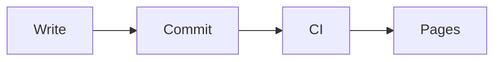
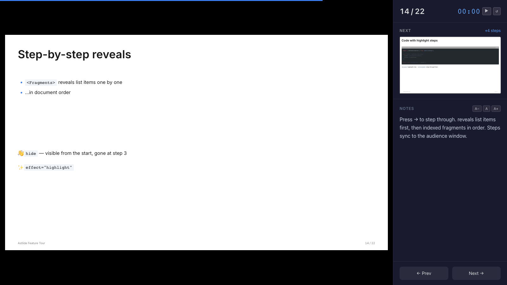
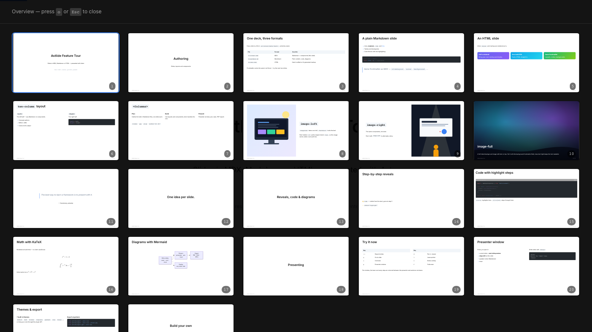
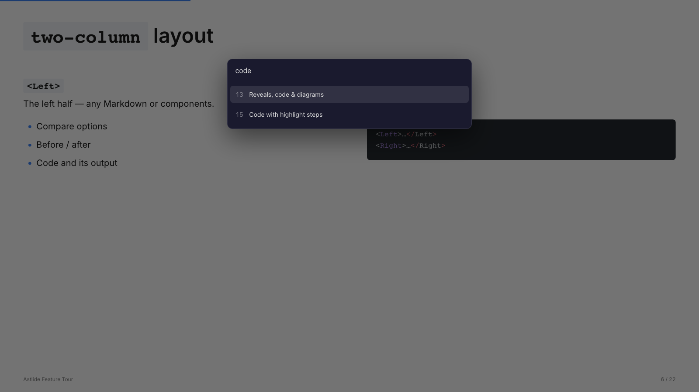
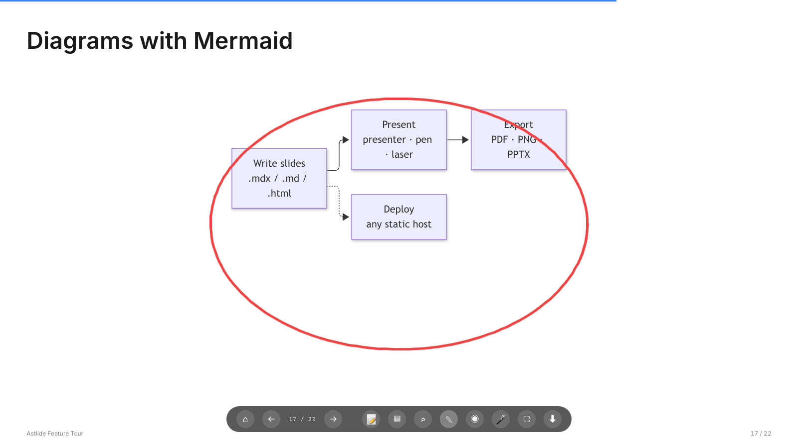

In this tutorial you'll build a five-slide talk, present it with the presenter window, export a PDF and publish it. It takes about 15 minutes.

You'll need [Bun](https://bun.sh) and a terminal.

## 1. Create a project

```bash
bun create astlide my-talks
cd my-talks
bun install
bun run dev
```

Open the URL the dev server prints. You'll see the **deck index** — every folder under `src/content/decks/` is a deck.

## 2. Create a deck

```bash
bunx create-astlide deck hello-astro --theme default --format mdx
```

This creates `src/content/decks/hello-astro/` with a `_config.json` and a few starter slides. Open `_config.json` and set your own details:

```json
{
  "title": "Hello, Astro",
  "author": "Your Name",
  "date": "2026-10-09",
  "theme": "default"
}
```

Delete the starter slides — we'll write our own. Slides are numbered files; the number sets the order.

## 3. A cover slide

Create `01-cover.mdx`:

```mdx
---
slideLayout: cover
notes: "Introduce yourself."
---

# Hello, Astro

Why I build my slides with code
```

The page updates as you save. `slideLayout: cover` centres the title; `notes` are only visible to you in the presenter window.

## 4. Reveal points one by one

Create `02-why.mdx`:

```mdx
---
slideLayout: default
---

# Why slides as code?

<Fragments>

- Version control and reviews
- Reuse components across talks
- Export to PDF and PowerPoint

</Fragments>
```

Press <kbd>→</kbd>: each bullet appears on its own step before the deck moves on. [Fragments](/astlide/guides/fragments/) can do much more — reveal several items together, hide them again, or highlight.

## 5. Walk through code

Create `03-code.mdx`. The `{1|3-5|all}` after the language steps through the highlighted lines:

````mdx
---
slideLayout: code
---

# A component

```astro {1|3-5|all}
<Card title="Hello">
  <p>
    Slides can render
    real components
  </p>
</Card>
```
````

## 6. Two columns and a diagram

Create `04-compare.mdx`:

```mdx
---
slideLayout: two-column
---

# Before and after

<Left>

### Before
Slides in a GUI app, exported by hand.

</Left>
<Right>

### After
Markdown in git, built by CI.

</Right>
```

And `05-flow.md` — a plain Markdown slide with a [Mermaid](/astlide/guides/diagrams/) diagram (run `bun add mermaid` first):

````md
---
slideLayout: default
---

# How it ships


````

Mixing `.mdx` and `.md` (and `.html`) in one deck is fine.

## 7. Present

Go back to slide 1 and press <kbd>p</kbd> to open the **presenter window**. It shows the next slide, how many steps are left, your notes and a timer. Move it to your laptop screen and put the original window on the projector — they stay in sync.



A few more keys worth knowing:

| Key | |
|---|---|
| <kbd>o</kbd> | Overview of all slides |
| <kbd>g</kbd> | Go to a slide by number or title |
| <kbd>d</kbd> / <kbd>l</kbd> | Pen / laser pointer — shown on the audience screen too |
| <kbd>f</kbd> | Fullscreen |







The full list is in [Presenting](/astlide/guides/presenting/).

## 8. Export a PDF

With the dev server running:

```bash
bunx playwright install chromium   # once — Playwright comes with @astlide/core
bunx astlide-export --deck hello-astro
```

You get `hello-astro.pdf` with every slide in its final state (all steps revealed). See [Export](/astlide/guides/export/) for PNG and PowerPoint.

## 9. Publish on GitHub Pages

Tell Astro where the site will live:

```js
// astro.config.mjs
export default defineConfig({
  site: "https://<user>.github.io",
  base: "/my-talks",
  integrations: [astlide()],
});
```

Push the project to a GitHub repository named `my-talks`, enable **Settings → Pages → Source: GitHub Actions**, and add Astro's [GitHub Pages workflow](https://docs.astro.build/en/guides/deploy/github/). Your talk is then at `https://<user>.github.io/my-talks/hello-astro/1/`.

## What's next

- Browse every layout and theme in the [Gallery](/astlide/gallery/).
- Try the [feature tour deck](https://r-hashi01.github.io/astlide/demo/tour/1/).
- Make it yours with [themes, plugins and decorators](/astlide/guides/themes-and-plugins/).
