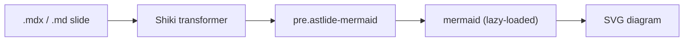

# Diagrams

```mermaid
flowchart LR
  MDX[".mdx / .md slide"] --> Shiki["Shiki transformer"]
  Shiki --> Pre["pre.astlide-mermaid"]
  Pre --> Mermaid["mermaid (lazy-loaded)"]
  Mermaid --> SVG["SVG diagram"]
```
