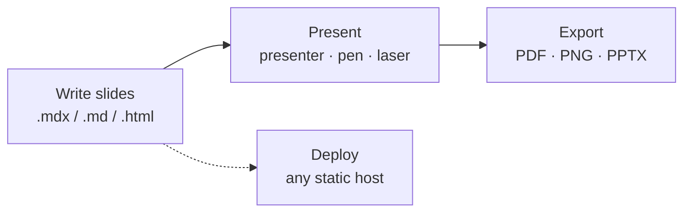

# Diagrams with Mermaid

```mermaid
flowchart LR
  A["Write slides<br/>.mdx / .md / .html"] --> B["Present<br/>presenter · pen · laser"]
  B --> C["Export<br/>PDF · PNG · PPTX"]
  A -.-> D["Deploy<br/>any static host"]
```
